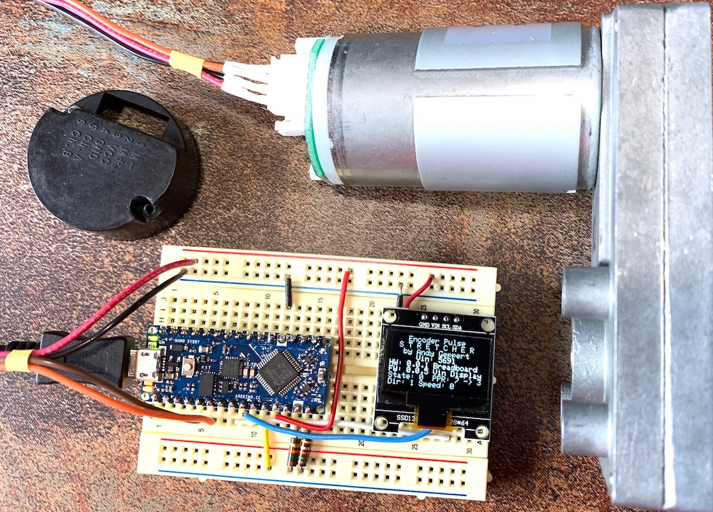

# Encoder-Pulse-Stretcher
Input is a real encoder (at 7 PPR), output is an artificial encoder with a reduced frequency (3 PPR).
This project is a work-in-progress in May 2020.

TO DO:
[ ] Read incoming encoder
